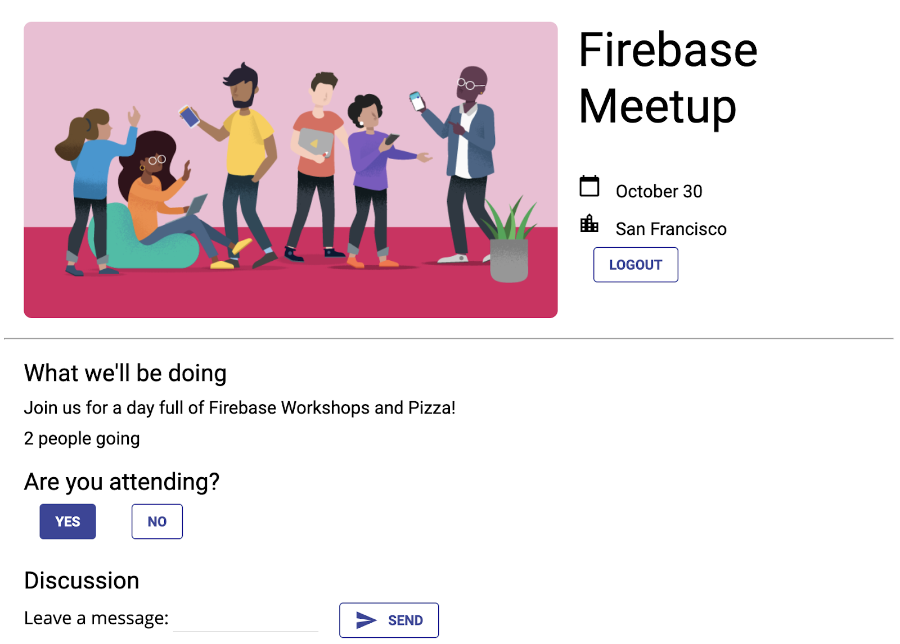

# Firebase Meetup
Get to Know Firebase for web Google codelab, in which I learned some of the basics of Firebase to create interactive web applications. I have build and deployed an event RSVP and guestbook chat app using several Firebase products.

## Screenshots

## Features
- [x] Firebase Authentication
- [x] FirebaseUI
- [x] Cloud Firestore
- [x] Firebase Security Rules
- [x] Firebase Hosting

## Tools & Languages
- HTML5
- Javascript
- Firebase
- VSCode

### How to use
>Here you can fing the lab so you can create your own app
[Get to know Firebase for web](https://codelabs.developers.google.com/codelabs/firebase-get-to-know-web/index.html?index=..%2F..index#0)

1) Create a project in the Firebase console
2) Enable
* Firestore (with rules in test mode) - [here](https://console.firebase.google.com/u/0/project/_/database)
* Email / Password Auth -  [here](https://console.firebase.google.com/u/0/project/_/authentication/providers)
3) Add a web app, and add the config snippet to index.js after `// Add Firebase config`- [here](https://console.firebase.google.com/u/0/project/_/settings/general/web)
 
